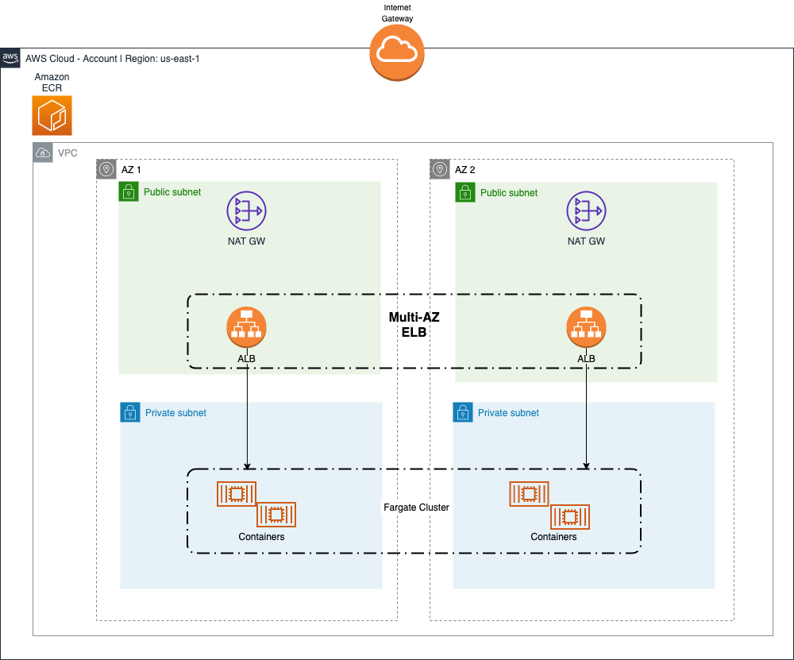
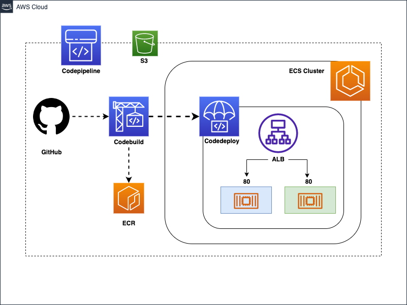
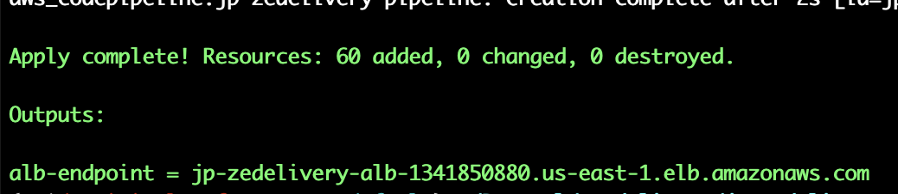
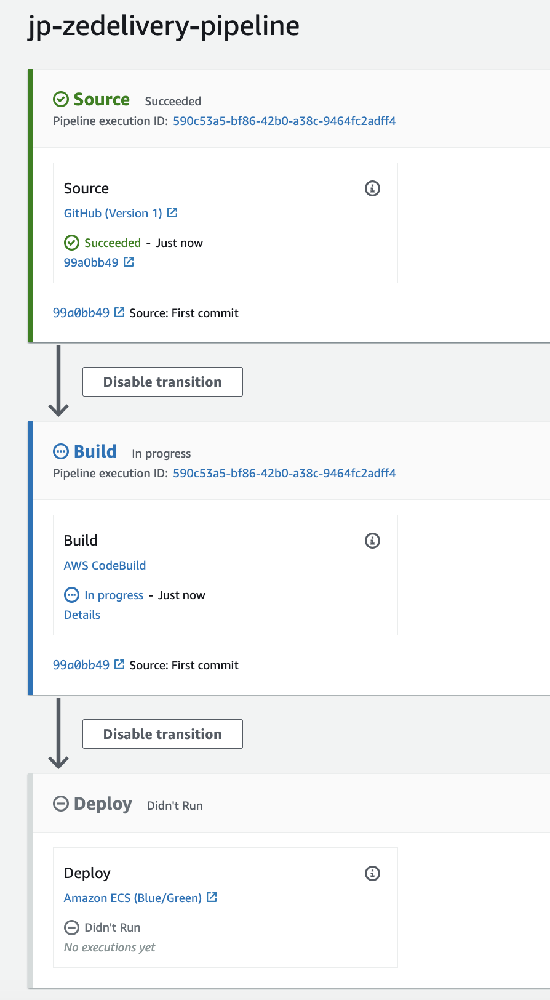
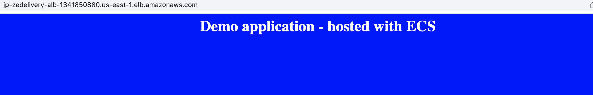
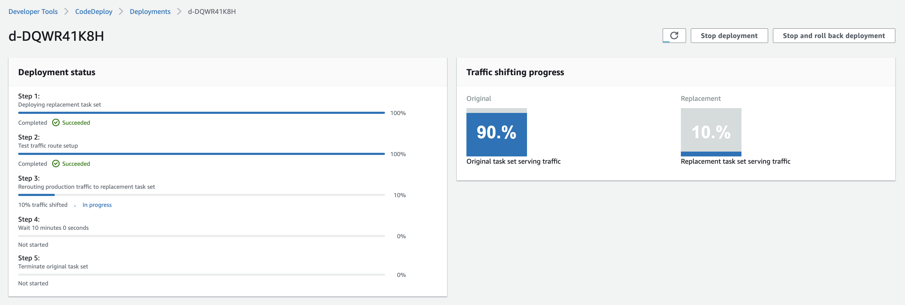
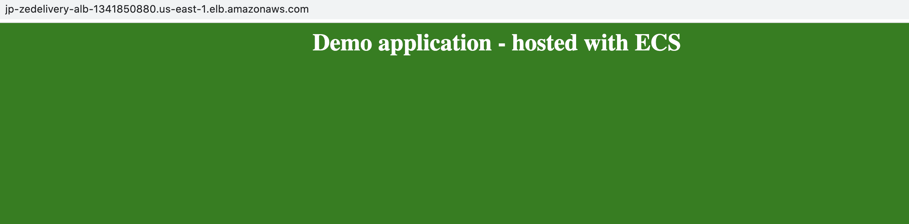
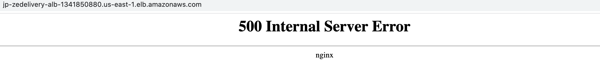
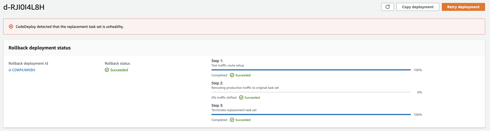

# JP Zé Delivery teste
O intuito deste projeto é deployar a projeto proposto de maneira facil, eficiente e automatizada. Este projeto consiste em uma estrutura de Terraform que ira criar todo um ambiente de ECS + Fargate junto com um pipeline completo que irá buildar a imagem da aplicação e fazer o deploy em canary de maneira automatica. 

## Arquitetura 



##  Pipeline



# How to Deploy
## Requisitos
* Uma conta/role na AWS que tenha permissão para criar os seguintes recursos:
  * ECS Fargate
  * Codepipeline
  * VPC
  * Codedeploy
  * Codebuild
  * IAM Roles
  * Application Load Balancer 

* Um bucket previamente criado para salvar o state do terraform.

* Terraform versão 0.13+.

* Conta no GitHub com GitHub Access Token configurado.

## Como Deployar

### 1) Github

* Crie um Github Access Token. [Neste link tem o tutorial de como fazer isto](https://help.github.com/articles/creating-a-personal-access-token-for-the-command-line/).

* Faça um fork deste [repositorio](https://github.com/jpalvesfernandes/jp-zedelivery-app) no GitHub. Ele será o repositorio da nossa aplicação e qualquer alteração na branch configurada ira triggar o deployment no Codepipeline.

### 2) Terraform 
* Edite o arquivo `terraform.tfvars` e adicione as variaveis referente ao github ou qualquer outra variavel que achar pertinente.
```hcl
git_repository_owner = <ACCOUNT>

git_repository_name = <REPOSITORY>

git_repository_branch = <BRANCH>

github_token = <TOKEN>
```

* Edite o arquivo main.tf e substitua o nome do bucket pelo bucket que foi criado para servir de tfstate ao Terraform

```hcl
terraform {
  backend "s3" {
    bucket = <BUCKET>
    key    = "state/terraform.tfstate"
    region = "us-east-1"
  }
}
```

* Inicialize os modulos/providers que iremos utilizar

```bash
terraform init
```

* Realize o planejamento das ações que o Terraform ira aplicar

```bash
terraform plan
```

* Aplique as açoes na AWS com o Terraform

```bash
terraform apply
```


## Demo

Aguarde o Deploy da infra inicial terminar, podemos acompanhar no painel do Codepipeline no console da AWS.




Podemos testar a aplicação acessando a url do Load Balancer que pegamos como Output do Terraform.



Vamos aplicar uma nova release da nossa aplicação, para isso vamos editar o arquivo `index.html` no repositorio de aplicação. Neste exemplo alterei a cor do fundo para verde.

```html
<head>
  <title>Demo Application</title>
</head>
<body style="background-color: green;">
  <h1 style="color: white; text-align: center;">
    Demo application - hosted with ECS
  </h1>
</body>
```

Com o novo commit na branch main o nosso pipeline foi triggado e podemos acompanhar o deployment pelo CodeDeploy:


Podemos testar antes mesmo do deploy finalizar, reinicie a pagina até cair no trafego da release nova.



Iremos agora injetar uma falha em uma nova release para podermos validar o Rollback. Edite o arquivo `nginx.conf` para que retorne status code 500 ao inves do `index.hmtl`

```nginx
listen  80;
root    /usr/share/nginx/html;
include /etc/nginx/mime.types;

location / {
    return 500;
}
```



Após 5 minutos com 10% na nova versão, o pipeline detectara que é um deploy falho e fara o rollback automatico.




## Finalização

Após validar a soluçao, realize a destruição dos recursos

```hcl
terraform destroy
```


